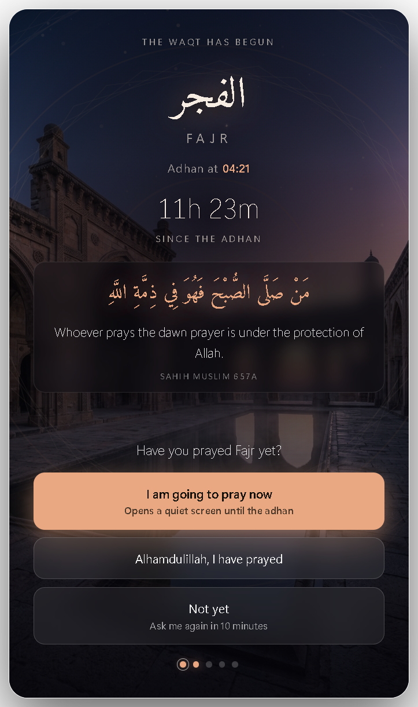
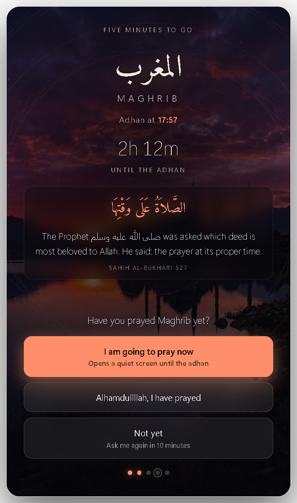
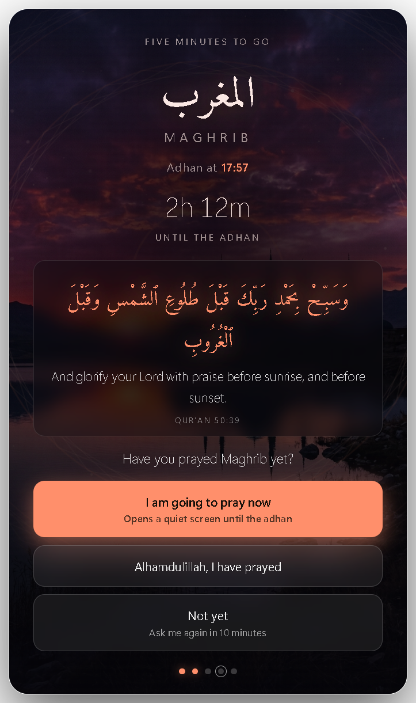
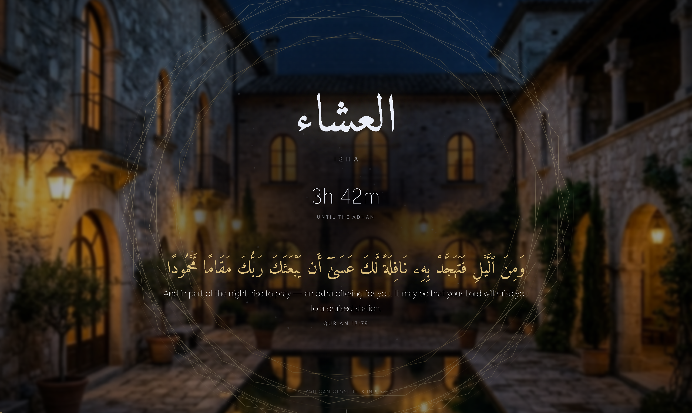

<div align="center">


# Salah Reminder

**A quiet Windows companion that asks, five minutes before every waqt, whether you have prayed.**

No accounts. No internet. No ads. It sits in your system tray and stays out of the way.

[Download for Windows](../../releases/latest) · [Report an issue](../../issues) · [Contribute](CONTRIBUTING.md)

</div>

---

<div align="center">



</div>

## What it does

Five minutes before each prayer, a card appears in the middle of your screen
with a verse or hadith for that prayer and one question.

| You choose | What happens |
|---|---|
| **I am going to pray now** | A full-screen scene opens with a countdown to the adhan. It holds for 10 minutes so it is not dismissed by reflex, then a button appears. Closes itself at 20 minutes. |
| **Alhamdulillah, I have prayed** | Closes. Nothing more for that waqt. |
| **Not yet** | Comes back in 10 minutes, up to eight times or until the waqt ends. |

Settings opens when you start the app so you can check your city and times.
Close it and the app carries on in the tray, where the icon shows today's five
times at a glance and counts complete days in a row. You can turn that opening
behaviour off in Settings.



## Why you might want it

- **It works offline, forever.** Prayer times are computed from the position of
  the sun on your own machine. No server, no API key, nothing to sign up for,
  nothing sent anywhere.
- **It asks rather than announces.** A notification you swipe away changes
  nothing. A question you have to answer is harder to ignore.
- **It is quiet.** No adhan blaring through your headphones in an open-plan
  office. A soft two-note chime you can turn off.

## Prayer times

Computed locally from the sun's declination and the equation of time, refined
twice, so they hold anywhere in the world.

- **Method:** Umm al-Qura by default; Muslim World League, ISNA, Egypt, Karachi
  and Gulf are all available.
- **Asr:** Hanafi by default. The standard reckoning is one click away.
- **It picks your city on first run** from your computer's time zone, so an
  install in Dhaka opens on Dhaka, with the translation already in Bangla.
- **57 cities** built in — pick yours and the coordinates and method fill
  themselves in. Anywhere else can be entered as coordinates.
- **Your time zone** comes from your Windows clock, so it is already right.
- **High latitudes** (London, Stockholm, Toronto) fall back to the
  one-seventh-of-the-night rule in midsummer, when Fajr and Isha do not exist
  astronomically.
- **Per-prayer fine tuning** to match your local masjid to the minute.

## Verses and hadith

Three for each prayer, rotating, in Arabic with a translation.

**Eight languages:** English, বাংলা, اردو, हिन्दी, Español, Français, Русский, 中文.

The Arabic Qur'an text is the Uthmani script from the Quran.com API. Hadith are
quoted in Arabic as given on sunnah.com, with the collection and number cited.

Every translation is an original plain-language rendering written for this app.
They are deliberately not taken from any published translation, because those
are copyrighted and this app is given away freely.

## The look

Each waqt has its own artwork, keyed to the light at that hour — the blue hour
before sunrise for Fajr, the overhead sun for Dhuhr, gold raking low for Asr,
the last of the sun for Maghrib, stars for Isha. There are two images per
prayer and it shows a different one each day.

Over the top sits generated Islamic star geometry, drawn from scratch every
frame. In Settings you can have the photograph with the geometry over it, the
photograph alone, or the geometry alone.

## Installing

Download **`SalahReminder-Setup-x.y.z.exe`** from the
[latest release](../../releases/latest) and run it.

Windows will show a blue **"Windows protected your PC"** box, because the app
is not code-signed — a signing certificate costs a few hundred dollars a year.
Click **More info**, then **Run anyway**. It happens the first time only.

There is also a portable `.zip` if you would rather not install: unzip it and
run `Salah Reminder.exe`.

Works on Windows 10 and 11, 64-bit.

## Building from source

```bash
git clone https://github.com/<your-username>/salah-reminder.git
cd salah-reminder
npm install
npm start
```

```bash
npm test            # prayer time engine and reminder logic
npm run selftest    # launches the real app and clicks every button
npm run dist        # builds the installer and the zip into dist/
```

## Support this project

It is free and always will be. If it helps you and you would like to give
something back, the **Sponsor** button at the top of this page is there for
that. It is not expected.

## Licence

MIT, see [LICENSE](LICENSE). Copyright 2026 Riazul Islam,
[riazulb9.com](https://riazulb9.com). The bundled
[Amiri](https://github.com/aliftype/amiri) font is under the SIL Open Font
Licence.
